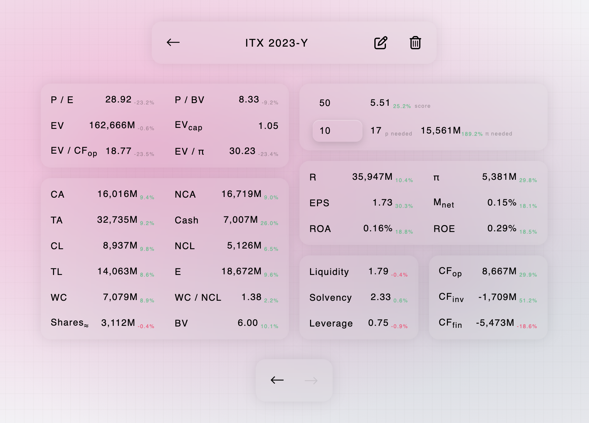

# Intrínseco

Intrínseco is a Javascript Electron-based desktop app that processes financial
reports, extracts and stores key metrics, and helps you quickly analyze
companies and track their finances.

<p align="center">
  
</p>

The name _Intrínseco_ comes from Benjamin Graham’s famous concept of intrinsic
value—the true worth of a company based on its fundamentals, rather than market
speculation. The app is designed to bring this philosophy into your workflow,
giving you a clear, data-driven view of businesses you’re evaluating.

## Installation

Prerequisites:

- Node.js.
- OpenAI API key (gpt-5-mini enabled).

```sh
git clone https://github.com/victorlopezarias/intrinseco
cd intrinseco
npm install
cp config.template.json config.json
# → edit config.json and add at least your OpenAI API key
npm run build
# Linux/macOS only →
chmod +x cli.js
npm link
```

To start Intrínseco, you have two options:

1. From the terminal:

```sh
intrinseco
```

2. From the project folder:

```sh
npm run start:prod
```

## Usage

### Input fields

When you click “+”, some input fields appear:

Mandatory fields:

- **Ticker** (name).
- **Period** — must follow one of these formats:
  - Year: YYYY-Y, e.g.: 2024-Y. To prevent errors, the -Y suffix is required.
  - Quarter: YYYY-Q#, e.g.: 2024-Q1. If “3 previous months” and “9 previous
    months” are reported, the pipeline will try to extract data relative to the
    3 previous months.
  - Semester: YYYY-S#, e.g.: 2024-S1.
- **Source**. Directly type an URL on the field or click the file icon to submit
  a file. Intrínseco currently supports .pdf, .html, .xhtml, .mhtml, .mht
  formats. Client-side rendered (CSR) websites are not supported; to attach one:
  right click → save as → single file, then submit the generated .mht. Banks and
  insurance companies are not well supported, as they do not follow traditional
  standard report formats.

Don’t attach a website when the actual target is a downloadable file, because no
browser interactions are performed. In that case, download or navigate directly
to the file you want and either attach it or paste its direct URL.

It’s recommended to analyze annual reports to avoid errors, since dates and
periods are usually more specific and there’s less chance of using incorrect
values.

Pay special attention if the company reports its results for the last period
(quarterly or annual) in January of the following year. Certain companies name
their reports in the year they present them. For example, MongoDB on 31/01/2024
presents its report containing information from 01/02/2023 to 31/01/2024,
practically all of 2023. In other cases, for example Inditex, it can be observed
that in its 2022 report, it uses 31/01/2023 for the balance sheet and 2022 for
the income statement. To address these complex scenarios and guarantee
consistency with the reflected data, the pipeline processes reports so that for
MongoDB it would return the 2023 annual report and for Inditex the 2022 annual
report, since those are the years covered. So if you were to analyze these
companies, you would use '2023-Y' as the period for MongoDB and '2022-Y' for
Inditex.

Optional fields:

- **Start** page.
- **End** page.

PDFs pages-selection works perfectly. HTML page detection relies on
document.querySelectorAll('.pageView'), so page selection is not guaranteed to
work.

It’s recommended to fill in page values in the following cases:

1. **Improve processing speed**. Huge files take longer and consume more
   resources. If you’re sure the results appear in, say, the first 10 pages, set
   End to 10.
2. **Improve precision**. For example, ASML presentations often include
   financial statements around page 240. You could set Start: 240 and End: 260.
3. **Avoid mistakes**. Many reports include both individual and consolidated
   statements. If you know consolidated statements start at page 10, set
   Start: 10.

When you submit, the pipeline runs. See [docs/pipeline.md](docs/pipeline.md) for
a detailed explanation of the pipeline.

Because the files can be large and complex, the organization and clarity of the
content are crucial for correct extraction. The AI can make mistakes. After
adding a company, if you detect any error you can manually modify values in the
data display UI by clicking the **edit** icon.

You can **delete** specific periods. To delete a company, delete all its periods
from within the company view.

### Data displayed

In a company view you can examine the company’s finances, compare data YoY
(year-over-year), and simulate scenarios for desired prices or P/E ratios and
the required net income.

Abbreviations are used for data labels to simplify visualization. The data shown
for each company is as follows:

**Data that requires a stock price to calculate:**

- **P / E**: _Price to Earnings Ratio_, stock price divided by net earnings per
  share.
- **P / BV**: _Price_ / Book Value, stock price divided by book value per share.
- **EV**: _Enterprise Value_, market capitalization plus debt minus cash.
- **EV<sub>cap</sub>**: _Enterprise Value_ to market capitalization.
- **EV / CF<sub>op</sub>**: _Enterprise Value_ divided by operating cash flow.
- **EV / π**: _Enterprise Value_ divided by net profit.

**Other data:**

- **CA**: Current Assets.
- **NCA**: Non-Current Assets.
- **TA**: Total Assets.
- **Cash**: Cash and cash equivalents.
- **CL**: Current Liabilities.
- **NCL**: Non-Current Liabilities.
- **TL**: Total Liabilities.
- **E**: Shareholders' Equity.
- **WC**: Working Capital, current assets minus current liabilities.
- **WC / NCL**: Working Capital divided by non-current liabilities.
- **Shares<sub>≈</sub>**: approximate shares. Given the inconsistency in
  financial file formats and different accounting practices, an approximation is
  calculated using net profit and EPS.
- **BV**: Book Value, shareholders' equity divided by shares.
- **R**: Revenue.
- **π**: Net Profit.
- **EPS**: Earnings Per Share. Will try to obtain the non-diluted value.
- **M<sub>net</sub>**: Net margin. Net profit divided by revenue.
- **ROA**: _Return on Assets_, net profit divided by total assets.
- **ROE**: _Return on Equity_, net profit divided by shareholders' equity.
- **Liquidity**: current assets divided by current liabilities.
- **Solvency**: total assets divided by total liabilities. If shareholders'
  equity is negative, "NA" will be shown, not available.
- **Leverage**: total liabilities divided by shareholders' equity. If
  shareholders' equity is negative, "NA" will be shown, not available.
- **CF<sub>op</sub>**: operating cash flow.
- **CF<sub>inv</sub>** investment cash flow.
- **CF<sub>fin</sub>**: financing cash flow.

If you’ve added the corresponding period from the previous year, the YoY
variation is shown as a percentage next to each data point.

At the top-right of the company view there are two inputs. One shows the
company’s stock price, where you can enter a value (e.g., the current or a
target price). The other shows “w P / E”, where you can enter a desired P/E
ratio.

- If you have filled in the price box, a score for the company at that specific
  price will be shown (see score explanation below).
- If you have filled in the P/E ratio box, the price needed to reach the desired
  P/E ratio will be shown.
- If you have filled in both boxes, the net profit required to reach the desired
  P/E ratio at that price and the percentage variation required compared to the
  current net profit will be shown.

The **score** is determined as follows:

Base Conditions:

- **NA** → if _Net Profit_, _Shares_, _EV_, or _P/BV_ are not valid
- **0** → if _EPS ≤ 0_ or _BV ≤ 0_ or _Operating CF ≤ 0_ or _Net Profit ≤ 0_
- **10** → if none of the above are met **and** _EV ≤ 0_
- Otherwise → **Score** = W₁R₁ + W₂R₂ + W₃R₃

Ratios:

- **R₁** = `10 * (1 - (EV/OCF) / 50)`, if `EV/OCF < 50`, else = 0
- **R₂** = `10 * (1 - (P/E) / 50)`, if `P/E < 50`, else = 0
- **R₃** = `10 * (1 - (P/BV) / 20)`, if `P/BV < 20`, else = 0

Weights:

| Case                 | W₁ (EV/OCF) | W₂ (P/E) | W₃ (P/BV) |
| -------------------- | ----------- | -------- | --------- |
| All ratios available | 0.4         | 0.3      | 0.3       |
| EV/OCF not available | –           | 0.5      | 0.5       |

A negative variation for any of the price-dependent metrics implies an
improvement in valuation. For example, a lower P/E or P/BV indicates a more
attractive valuation given a constant price across periods.

It’s recommended to use the speculation features with annual data. If you
speculate with quarterly or semi-annual data, the values won’t reflect the
company’s annual position. For example, net profit will be for that quarter or
semester, not the full year, so the score will be worse and the required price
and profit higher. A rough approximation is to multiply/divide by 4 for
quarterly and by 2 for semi-annual, but this won’t reflect seasonality and other
factors.

### Common Errors

Given the inconsistency of financial reports and the overwhelming amount of
formats used, the AI can be led to errors. Some of the most common errors are:

- ❌ **Submitting unsupported companies sectors**. Such as insurance companies
  or banks. In these cases, some of the data that the pipeline tries to obtain
  is not reported, which will lead to errors and inconsistencies.

- ❌ **Requesting quarterly information when the report shows data for the
  previous 9 months** For example, Apple occasionally reports _"9 months
  ended"_. Keep in mind that certain financial statements report the cumulative
  total across quarters. Exercise extreme care in these scenarios and maintain
  consistency in the files sent. In other cases (e.g., Spotify), they report
  their most recent quarterly report and in the balance sheet compare the data
  with the previous year-end close, so the balance sheet may show 2024-Q1
  compared to 2023-Q4.

- ❌ **Sending files that do not contain text**, but where each page is an
  image. For example sending a PDF consisting of images. In these cases the
  information cannot be extracted, since Intrínseco relies on LLMs that will not
  process images.

- ❌ **Calculating and interpreting the score and speculated values with
  quarterly or semi-annual data**. Since they do not reflect the company's
  annual results.

- ❌ **Sending financial reports that contain multiple periods**. For example a
  report that shows an income statement with quarterly, semi-annual, and annual
  data covering 3 years, and where consolidated and non-consolidated versions
  appear. Such a report could contain 18 potential values for each metric,
  increasing the chance of mixing up data. It is recommended to send files that
  do not cover multiple periods. The more precise the period, the better.
  Remember that you can also select a page range.

- ❌ **Entering a wrong period that does not correspond to the report**.

- ❌ **Confusing the calendar year with the fiscal year**. For example, a
  company may report its 2024 financial statement in March 2024, containing most
  of the data from 2023. Try to always use the same reports for that company,
  ideally their annual reports.

💡 **Recommendation:**  
Try to always send the same type of report for each company and preferably
consolidated reports. The more standardized and professional the report, the
easier it will be to correctly extract the information.

## To-dos

See [docs/todos.md](docs/todos.md) for the current development roadmap.
